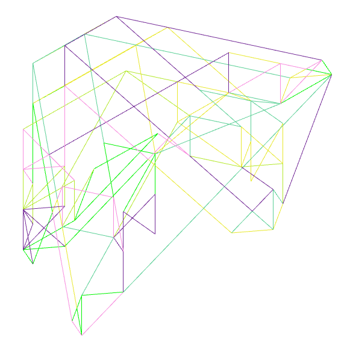
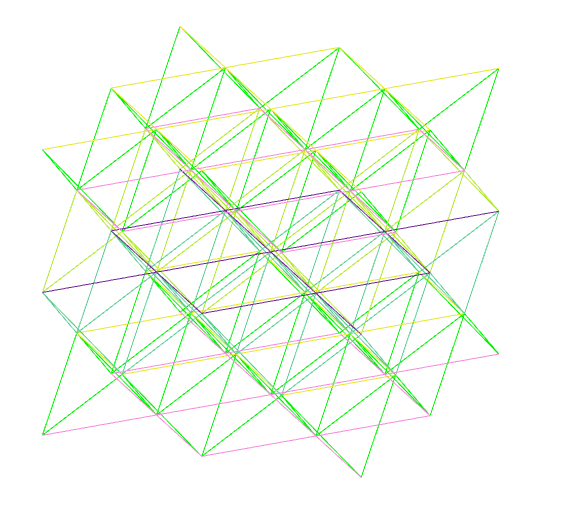
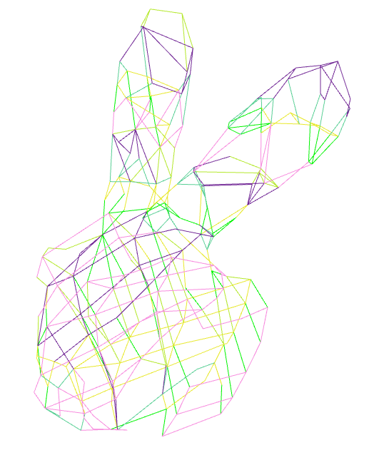
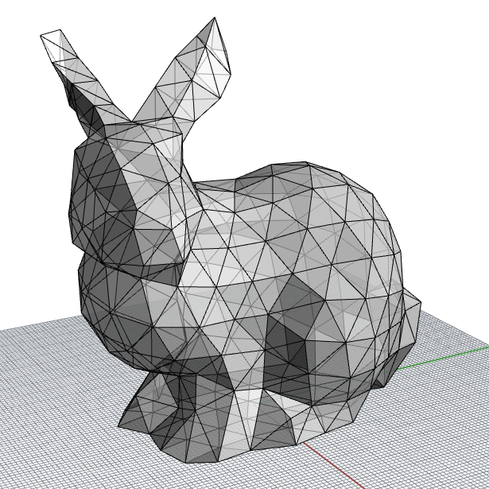
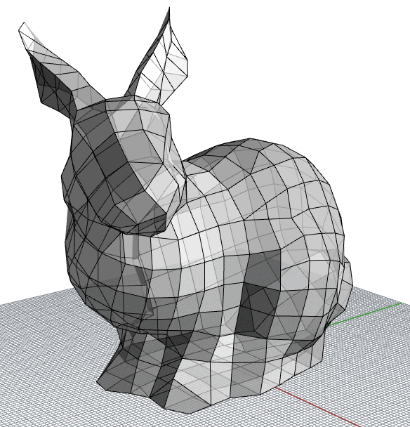
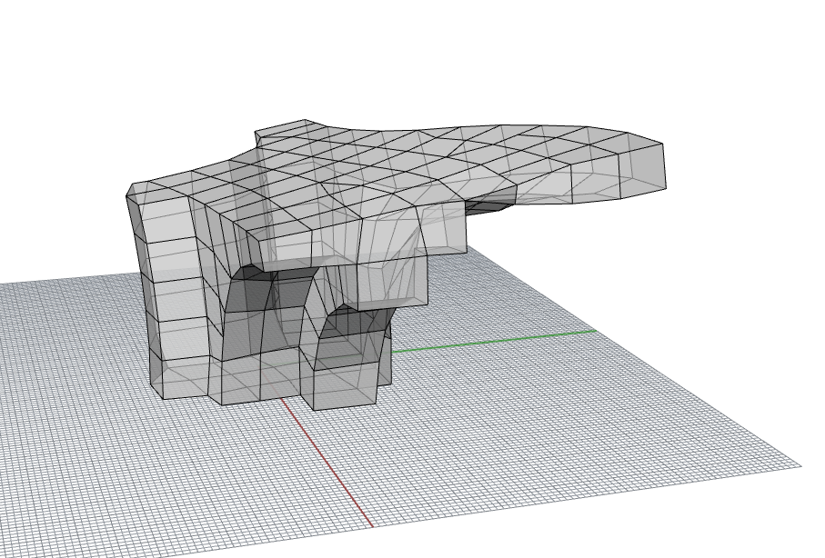
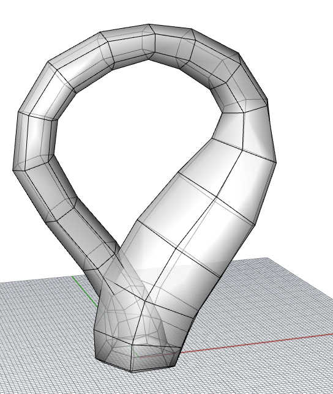

# Extrusion instance catalogue

## TopOpt models

The models in this section come from the following papers:

1. Huang, Yijiang, Josephine V. Carstensen, and Caitlin T. Mueller. "3D truss topology optimization for automated robotic spatial extrusion." Proceedings of IASS Annual Symposia. Vol. 2018. No. 19. International Association for Shell and Spatial Structures (IASS), 2018.

2. Huang, Yijiang, et al. "Robotic extrusion of architectural structures with nonstandard topology." Robotic fabrication in architecture, art and design. Springer, Cham, 2018.

### topopt-100

### topopt-205

### topopt-310

------
## Models with irregular topologies

The models in this section come from the following paper:

1. Huang, Yijiang, et al. "Robotic extrusion of architectural structures with nonstandard topology." Robotic fabrication in architecture, art and design. Springer, Cham, 2018.

### voronoi

### mars_bubble

------
## Bridge models

The models in this section come from the following paper:

1. Tam, Kam-Ming Mark, et al. "Fabrication-aware structural optimisation of lattice additive-manufactured with robot-arm." International Journal of Rapid Manufacturing 7.2-3 (2018): 120-168.

### djmm_block

### djmm_bridge

------
## NCCR models
### compas_fea beam tree
This model comes from one of the examples of compas_fea: [webpage](https://compas-dev.github.io/compas_fea/examples/beam_tree_rhino.html)

### robarch tree
This model comes from Gramazio&Kohler research's RobArch workshop in 2018: [webpage](http://gramaziokohler.arch.ethz.ch/web/e/forschung/311.html)

------
## Graphics models

The models in this section come from the following papers:

1. Rundong Wu, Huaishu Peng, François Guimbretière, and Steve Marschner. 2016. Printing arbitrary meshes with a 5DOF wireframe printer. ACM Trans. Graph. 35, 4, Article 101 (July 2016), 9 pages. DOI: https://doi.org/10.1145/2897824.2925966, [webpage](http://www.cs.cornell.edu/projects/wireprint/)

2. Yijiang Huang, Juyong Zhang, Xin Hu, Guoxian Song, Zhongyuan Liu, Lei Yu, and Ligang Liu. 2016. FrameFab: robotic fabrication of frame shapes. ACM Trans. Graph. 35, 6, Article 224 (November 2016), 11 pages. DOI: https://doi.org/10.1145/2980179.2982401, [webpage](http://staff.ustc.edu.cn/~juyong/FrameFab.html)

3. Rahul Arora, Alec Jacobson, Timothy R. Langlois, Yijiang Huang, Caitlin Mueller, Wojciech Matusik, Ariel Shamir, Karan Singh, and David I. W. Levin. 2019. Volumetric Michell trusses for parametric design & fabrication. In Proceedings of the ACM Symposium on Computational Fabrication (SCF '19), Stephen N. Spencer (Ed.). ACM, New York, NY, USA, Article 6, 13 pages. DOI: https://doi.org/10.1145/3328939.3328999, [webpage](https://www.dgp.toronto.edu/projects/michell/)

The quad meshes are generated using Wenzel Jacob's [instant-meshes](https://github.com/wjakob/instant-meshes).

### art-opt_bunny

### bunny_tri

### bunny_tri_dense

### bunny_full_quad

### duck

### fandisk

### fertility

### klein_bottle

### tri-foil knot

### semi_sphere

### David

### C_shape

------
## Paremeter tuning / test models

The following models are used to tune the fabrication parameters or software unit tests.

### long_beam_test

### extreme_beam_test

